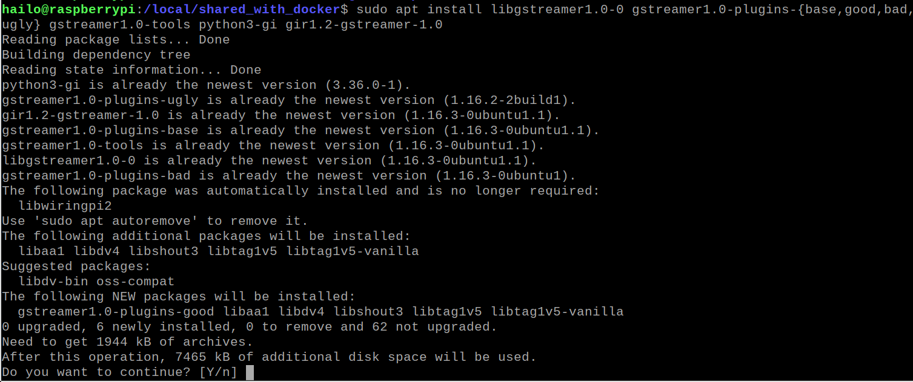

## New libraries to download



## Install OpenCV
(https://medium.com/@arfanmahmud47/build-opencv-4-from-source-with-gstreamer-ubuntu-zorin-peppermint-c2cff5393ef)
```console
# At first, update
$ source hailo_virtualenv/bin/activate
$ sudo apt update
# Secondly, install Gstreamer and it’s plugins along with its tools
$ sudo apt-get install libgstreamer1.0–0 gstreamer1.0-plugins-base gstreamer1.0-plugins-good gstreamer1.0-plugins-bad gstreamer1.0-plugins-ugly gstreamer1.0-libav gstreamer1.0-doc gstreamer1.0-tools gstreamer1.0-x gstreamer1.0-alsa gstreamer1.0-gl gstreamer1.0-gtk3 gstreamer1.0-qt5 gstreamer1.0-pulseaudio
$ sudo apt install gstreamer1.0-tools
# Codec libraries
$ sudo apt-get install -y libavcodec-dev libavformat-dev libavutil-dev libswscale-dev libavresample-dev
$ sudo apt install pkg-config
$ sudo apt install libgtk-3-dev
$ mkdir opencv
$ cd opencv
$ git clone https://github.com/opencv/opencv.git
$ git clone https://github.com/opencv/opencv_contrib.git
$ mkdir build
$ cd build
$ cmake -D CMAKE_BUILD_TYPE=RELEASE -D CMAKE_INSTALL_PREFIX=/usr/local INSTALL_PYTHON_EXAMPLES=ON -D INSTALL_C_EXAMPLES=OFF -D OPENCV_ENABLE_NONFREE=ON -D OPENCV_EXTRA_MODULES_PATH=/local/shared_with_docker/opencv/opencv_contrib/modules -D PYTHON_EXECUTABLE=$(which python) -D BUILD_opencv_python2=OFF -D CMAKE_INSTALL_PREFIX=$(python -c "import sys; print(sys.prefix)") -D PYTHON3_EXECUTABLE=$(which python) -D PYTHON3_INCLUDE_DIR=$(python -c "from distutils.sysconfig import get_python_inc; print(get_python_inc())") -D PYTHON3_PACKAGES_PATH=$(python -c "from distutils.sysconfig import get_python_lib; print(get_python_lib())") -D WITH_GSTREAMER=ON -D BUILD_EXAMPLES=ON ..
$ sudo make -j$(nproc) #Takes 3 hours
$ sudo make install
$ sudo ldconfig

```
